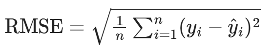
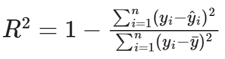

# Power Outage Analysis

by Andre Gala-Garza (asgala@umich.edu)

## Introduction

This dataset has major power outage data in the continental U.S. from January 2000 to July 2016.

The data can be found [here](https://engineering.purdue.edu/LASCI/research-data/outages).

A data dictionary is available at this [article](https://www.sciencedirect.com/science/article/pii/S2352340918307182) under *Table 1. Variable descriptions*.

### Questions to Explore
These are some possible questions to explore regarding this dataset:

- Where and when do major power outages tend to occur?
- What are the characteristics of major power outages with higher severity? Variables to consider include location, time, climate, land-use characteristics, electricity consumption patterns, economic characteristics, etc. What risk factors may an energy company want to look into when predicting the location and severity of its next major power outage?
- What characteristics are associated with each category of cause?
- How have characteristics of major power outages changed over time? Is there a clear trend?

Out of these, I plan to explore the following question:

**What characteristics lead to power outages with longer durations?**

## Data Cleaning and Exploratory Data Analysis

### Data Cleaning

#### Drop unnecessary columns

#### Combine date and time columns into Timestamp columns

#### Replace 0 with np.nan

#### Impute all NaN values in `TOTAL.PRICE` with the mean

#### Remove all rows where `CLIMATE.REGION` is not applicable

#### Remove all rows where `OUTAGE.DURATION` is not applicable

### Univariate Analysis

#### Number of Outages for Each Major Cause

<iframe
  src="assets/num_outages_by_major_cause.html"
  width="800"
  height="600"
  frameborder="0"
></iframe>

#### Distribution of Outages by Total Customers

<iframe
  src="assets/outages_by_total_customers.html"
  width="800"
  height="600"
  frameborder="0"
></iframe>

####  Distribution of El Niño/La Niña Anomaly Level

<iframe
  src="assets/anomaly_level_distribution.html"
  width="800"
  height="600"
  frameborder="0"
></iframe>

### Bivariate Analysis

#### Line Plot of Average Outage Duration Over Time

<iframe
  src="assets/average_outage_duration_over_time.html"
  width="800"
  height="600"
  frameborder="0"
></iframe>

#### Choropleth of Average Power Outage Duration by State

<iframe
  src="assets/average_outage_duration_by_state.html"
  width="800"
  height="600"
  frameborder="0"
></iframe>

#### Scatter Plot of Outage Duration vs. Month of Outage

<iframe
  src="assets/outage_duration_by_month.html"
  width="800"
  height="600"
  frameborder="0"
></iframe>

#### Scatter Plot of Outage Duration vs. Major Cause

<iframe
  src="assets/outage_duration_vs_major_cause.html"
  width="800"
  height="600"
  frameborder="0"
></iframe>

#### Scatter Plot of Outage Duration vs. Peak Demand Loss

<iframe
  src="assets/outage_duration_vs_peak_demand_loss.html"
  width="800"
  height="600"
  frameborder="0"
></iframe>

#### Scatter Plot of Outage Duration vs. El Niño/La Niña Anomaly Level

<iframe
  src="assets/outage_duration_vs_anomaly_level.html"
  width="800"
  height="600"
  frameborder="0"
></iframe>

#### Box Plots of Outage Duration vs. Climate Region

<iframe
  src="assets/outage_duration_by_climate_region.html"
  width="800"
  height="600"
  frameborder="0"
></iframe>

<iframe
  src="assets/climate_region_choropleth.html"
  width="800"
  height="600"
  frameborder="0"
></iframe>

### Interesting Aggregates

Here is one table:

| CLIMATE.REGION     |   OUTAGE_DURATION_MEAN |   CUSTOMERS_AFFECTED_MEAN |   DEMAND_LOSS_MW_MEAN |
|:-------------------|-----------------------:|--------------------------:|----------------------:|
| Central            |               2882.21  |                  144424   |               595.682 |
| East North Central |               5391.4   |                  149816   |               633.902 |
| Northeast          |               3330.52  |                  177848   |              1013.4   |
| Northwest          |               1536.36  |                  136768   |               336.036 |
| South              |               2872.45  |                  212031   |               475.686 |
| Southeast          |               2247.66  |                  202705   |               865.318 |
| Southwest          |               1621.41  |                   66121.1 |               903.25  |
| West               |               1636.31  |                  217946   |               711.566 |
| West North Central |                796.071 |                   66242.4 |               251.333 |

Here is another table:

| NERC.REGION   |   OUTAGE_DURATION_MEAN |   CUSTOMERS_AFFECTED_MEAN |   DEMAND_LOSS_MW_MEAN |
|:--------------|-----------------------:|--------------------------:|----------------------:|
| ECAR          |                5603.31 |                    260624 |              1394.48  |
| FRCC          |                4271.12 |                    385068 |              1108     |
| FRCC, SERC    |                 372    |                       nan |               nan     |
| MRO           |                3001.81 |                    107524 |               281.429 |
| NPCC          |                3578.65 |                    164358 |              1695.22  |
| RFC           |                3767.79 |                    157057 |               429.434 |
| SERC          |                1765.29 |                    117203 |               608.125 |
| SPP           |                2783.57 |                    231177 |               192.118 |
| TRE           |                2988.24 |                    253805 |               739.093 |
| WECC          |                1578.27 |                    182706 |               664.74  |

### Imputations

In the column `TOTAL.PRICE`, which indicates the average monthly electricity price in the U.S. state corresponding to a certain outage, a total of 22 values were missing (`NaN`). I considered these values to be missing completely at random (MCAR), due to the small number of these outages and their varying indices from across the original dataset. Since the distribution of the column appeared relatively normal, I felt that these missing values would be representative of the dataset as a whole. Therefore, I chose to use mean imputation on these values by replacing them with the mean `TOTAL.PRICE` for all outages.

This is what the distribution of `TOTAL.PRICE` looked like before imputation:

<iframe
  src="assets/total_price_before_imputation.html"
  width="800"
  height="600"
  frameborder="0"
></iframe>

As there were only 22 missing values, the appearance of the distribution remained unchanged after imputation:

<iframe
  src="assets/total_price_after_imputation.html"
  width="800"
  height="600"
  frameborder="0"
></iframe>

## Framing a Prediction Problem

My prediction problem is to predict the duration of a power outage; therefore, the response variable is `OUTAGE.DURATION`. This is a regression problem, since the model will predict the continuous quantity of how long a power outage lasts. I chose this response variable because when a household has a power outage, having an estimate of the time taken before recovery is crucial for making decisions such as whether to use a backup generator or continue storing perishable food.

The time of prediction would be immediately at the start of a power outage. Therefore, at prediction time, the following variables from the original dataset would be known: `OUTAGE.START.DATE`, `OUTAGE.START.TIME`, `YEAR`, `MONTH`, `POSTAL.CODE`, `NERC.REGION`, `CLIMATE.REGION`, `ANOMALY.LEVEL`, `CAUSE.CATEGORY`, `CAUSE.CATEGORY.DETAIL`, `TOTAL.PRICE`, `TOTAL.CUSTOMERS`.

Clearly, variables such as `OUTAGE.RESTORATION.DATE` and `OUTAGE.RESTORATION.TIME` are outcome variables not available at the start of an outage.

Regional economic and land-use characteristics from the original dataset, such as `PC.REALGSP.STATE` or `POPULATION`, are aggregated at a regional or state level, and thus do not provide specific information about the infrastructure or condition at the exact location of an outage. Therefore, I chose to exclude these variables from my model.

For my regression model, I will use the performance metric of root mean squared error (RMSE):

I chose this metric because it is similar to the mean squared error (MSE), which penalizes larger errors more than smaller ones due to the squaring term. This makes it a better metric than mean absolute error (MAE), because incorrect predictions can have critical consequences in this case. For example, significantly underestimating a long outage may cause a family in a household with said outage to keep food in their refrigerator only for said food to perish. However, I also wanted to balance the sensitivity to large errors with immediate interpretability. Since RMSE produces a prediction with the same units as the response variable (in this case, the number of hours for which a duration lasts), it is ideal for my model.

I will additionally use the R^2 metric:

This helps compare the predictive power of my baseline model with my final model, which adds more features to use for predictions.

## Baseline Model

My baseline model predicts the duration of an outage using features that are straightforward, immediately available, and broadly applicable across all outages.

The features I used in the baseline model are as follows: `MONTH`, `ANOMALY.LEVEL`, `POSTAL.CODE`, `CAUSE.CATEGORY`, `CLIMATE.REGION`.
- `MONTH` (ordinal) is useful for identifying temporal or seasonal patterns in outages, and unlike `YEAR`, it is generalizable to future dates and is not too broad of a duration in between measurements.
- `ANOMALY.LEVEL` (quantitative) captures El Niño/La Niña anomalies, which could impact weather-related outage durations. This is especially useful for extreme or weather-sensitive scenarios, which helps account for the outliers in the data set.
- `POSTAL.CODE` (nominal) provides geographic specificity that can account for localized infrastructure or response capabilities.
- `CAUSE.CATEGORY` (nominal) captures high-level reasons for outages, which are directly linked to their expected durations (e.g., equipment failure vs. severe weather).

In this model, the quantiles for numerical features (`MONTH`, `ANOMALY.LEVEL`) are reduced to 500, which is ensured to be below the number of samples in the dataset. Meanwhile, categorical features (`POSTAL.CODE`, `CAUSE.CATEGORY`) are encoded using OneHotEncoder to convert nominal categories into dummy variables.

The RMSE of the baseline model is 6426.33, and its R^2 value is 0.133345. Here is a line plot comparing the baseline model's predictions for outage durations and the actual durations:

<iframe
  src="assets/actual_vs_baseline_pred.html"
  width="800"
  height="400"
  frameborder="0"
></iframe>

## Final Model

My final model includes additional features that offer finer granularity to improve predictive accuracy.

The features I used in the final model are as follows: `MONTH`, `ANOMALY.LEVEL`, `POSTAL.CODE`, `CAUSE.CATEGORY`, `CLIMATE.REGION`, `NERC.REGION`, `TOTAL.PRICE`, `TOTAL.CUSTOMERS`.

Here is an explanation of why I added the new features to the final model:

- `CLIMATE.REGION` (nominal) represents regional weather characteristics that influence the duration of outages (e.g., storms in the Southeast vs. snowstorms in the Midwest).
- `NERC.REGION` (nominal) represents reliability regions, reflecting differences in grid infrastructure and operational capabilities.
- `TOTAL.PRICE` (quantitative) indicates the cost of electricity, which may correlate with infrastructure investment levels or restoration priorities.
- `TOTAL.CUSTOMERS` (quantitative) reflects the scale of the outage and could relate to the resources allocated for restoration.

Within my `sklearn` Pipeline, I also create two new features:

- I use a `Normalizer` to normalize values of `ANOMALY.LEVEL` to the unit norm. This creates a variable that consists of the positive and negative signs associated with the anomaly level of each outage.
- I use a `Binarizer` that evaluates to 1 if `TOTAL.CUSTOMERS` is 6 million or greater, and 0 otherwise. This separates outages into two groups: one has a relatively normal distribution for `TOTAL.CUSTOMERS`, and the other does not.

`GridSearchCV` performs an exhaustive search over the specified parameter grid to optimize `RandomForestRegressor` parameters, such as:
- `n_estimators`: Number of trees.
- `max_depth`: Maximum depth of the trees.
- `min_samples_split`: Minimum samples required to split an internal node.
- `min_samples_leaf`: Minimum samples required in a leaf node.

The RMSE of the final model evaluated to 6307.16, and its R^2 value is 0.165188. This is an improvement from the baseline model's RMSE and R^2 of 6426.33 and 0.133345, respectively, since RMSE should be minimized and R^2 should be maximized.

Here is a line plot comparing the final model's predictions for outage durations and the actual durations:

<iframe
  src="assets/actual_vs_final_pred.html"
  width="800"
  height="400"
  frameborder="0"
></iframe>

This line plot compares both models against each other, along with the actual durations:

<iframe
  src="assets/actual_vs_both_preds.html"
  width="800"
  height="400"
  frameborder="0"
></iframe>

From the above graph, we can see that the final model's prediction for outage durations (in green) matches the actual durations (in blue) quite closely, when taking into account the large fluctuations made by the outage duration over time. Therefore, we can conclude that the final model will generalize relatively well to unseen data.
